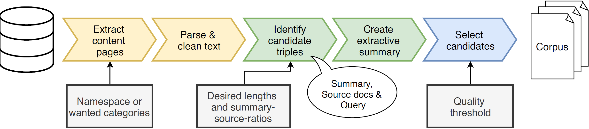

The Fandom Corpus Framework and the corresponding sample Fandom Corpora were published at LREC 2020. [You can access the full paper in the ACL anthology.](https://www.aclweb.org/anthology/2020.lrec-1.827/)

Fandom Corpus is a framework to create topic-specific multi-document summarization (mds) corpora. An overview over the pipeline can be found in the following figure:



The essential steps of our approach are: (1) parsing and cleaning of input documents, (2) selecting potential candidates for abstractive summaries from those input documents and assigning summary candidates to them, and (3) choosing the final set of abstractive summaries based upon a new quality threshold and splitting the selected summaries into training,
validation, and test set if needed.


### Licence & Citatation

The code is published under a MIT License. If you are using the system for research, please cite our work as follows.

```
@inproceedings{hattasch-etal-2020-summarization,
    title = "Summarization Beyond News: The Automatically Acquired Fandom Corpora",
    author = {H{\"a}ttasch, Benjamin  and
      Geisler, Nadja  and
      Meyer, Christian M.  and
      Binnig, Carsten},
    booktitle = "Proceedings of The 12th Language Resources and Evaluation Conference",
    month = may,
    year = "2020",
    address = "Marseille, France",
    publisher = "European Language Resources Association",
    url = "https://www.aclweb.org/anthology/2020.lrec-1.827",
    pages = "6700--6708",
    abstract = "Large state-of-the-art corpora for training neural networks to create abstractive summaries are mostly limited to the news genre, as it is expensive to acquire human-written summaries for other types of text at a large scale. In this paper, we present a novel automatic corpus construction approach to tackle this issue as well as three new large open-licensed summarization corpora based on our approach that can be used for training abstractive summarization models. Our constructed corpora contain fictional narratives, descriptive texts, and summaries about movies, television, and book series from different domains. All sources use a creative commons (CC) license, hence we can provide the corpora for download. In addition, we also provide a ready-to-use framework that implements our automatic construction approach to create custom corpora with desired parameters like the length of the target summary and the number of source documents from which to create the summary. The main idea behind our automatic construction approach is to use existing large text collections (e.g., thematic wikis) and automatically classify whether the texts can be used as (query-focused) multi-document summaries and align them with potential source texts. As a final contribution, we show the usefulness of our automatic construction approach by running state-of-the-art summarizers on the corpora and through a manual evaluation with human annotators.",
    language = "English",
    ISBN = "979-10-95546-34-4",
}

```


### Data

[Dowload the data and read about its structure](data.md).


### Usage

Read about [how to use the framework](usage.md).
